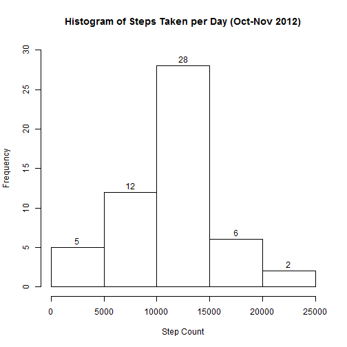
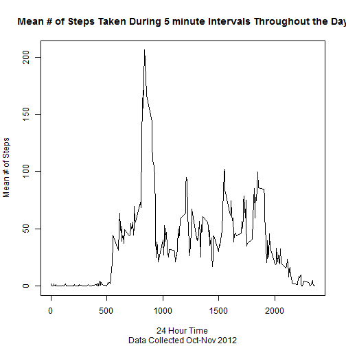
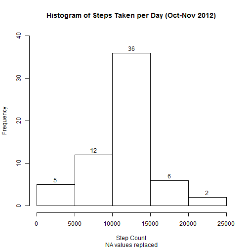
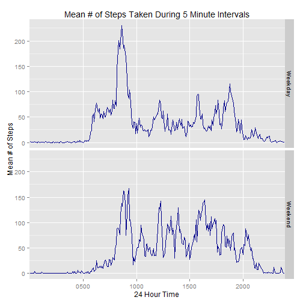

In this assignment, data from a personal activity monitoring device was analyzed to investigate activity patterns for an anonymous person.  The device recorded number of steps taken during 5 minute intervals over a two month period (Oct-Nov 2012).  

The data was downloaded from the Reproducible Research course website and saved to a folder on my computer:

"C:/Users/Renee/Documents/Coursera/ReproducibleResearch/RepData_PeerAssessment1"
        
The data consists of 3 columns of data as described below.

- column 1:  steps - # of steps taken in the 5 minute interval (missing data = NA)
- column 2:  date - (YYYY-MM-DD)
- column 3:  interval - Time interval (0,5,10,...50,55,100,105,...2350,2355)

The first step is to read in the data and make it clean and tidy.  The time is padded with leading zeros to make the time column consistent with 4 digit miltary time.  The str_pad() function takes care of this.  The date was then converted into a standard date format.


```r
library(stringr)
setwd("C:/Users/Renee/Documents/Coursera/GitRepos/ReproducibleResearch/RepData_PeerAssessment1")
classes <- c("numeric", "character", "character")
activity_data <- read.csv("activity.csv", header = TRUE, colClasses = classes)
activity_data[,3] <- str_pad(activity_data[,3], 4, pad = "0")
activity_data$date <- as.Date(activity_data$date, "%Y-%m-%d")
```

The first question:  **What is the mean total of steps taken per day?** (Ignoring NA values.)

The data are grouped by date and summarized in dplyr to find the mean total of steps taken per day.  The data are plotted in a histogram showing number of days that fall under different ranges of step counts.


```r
library(dplyr)
activity_tbl <- tbl_df(activity_data)
activity_groupby_date <- group_by(activity_tbl, date)
activity_dailysteps <- summarize(activity_groupby_date, steps = sum(steps))

mean_steps <- mean(activity_dailysteps$steps, na.rm = TRUE)
mean_steps <- as.integer(mean_steps)
median_steps <- median(activity_dailysteps$steps, na.rm = TRUE)
median_steps <- as.integer(median_steps)

hist(activity_dailysteps$steps, main = paste("Histogram of Steps Taken per Day (Oct-Nov 2012)"),
             ylim = c(0, 30), xlab = "Step Count", labels = TRUE)
```

 

####The mean number of steps taken per day is 10766 and the median is 10765.
_____


The second question:  **What is the average daily activity pattern?** (Ignoring NA values.)

The data are grouped by time interval and summarized in dplyr to find the average number of steps per interval over the two month period.  The mean number of steps is plotted versus the 5 minute time period.  Please note that the time is read as military time, for example, 0520 is 5:20 a.m. and 2105 is 9:05 p.m.


```r
activity_groupby_int <- group_by(activity_tbl, interval)
activity_intsteps <- summarize(activity_groupby_int, mean_int_steps = mean(steps, na.rm = TRUE))

max_steps <- max(activity_intsteps[,2])
max_steps <- as.integer(max_steps)
int_steps <- activity_intsteps[,2]
int_steps <- unlist(int_steps)
max_loc <- which.max(int_steps)
max_time <- activity_intsteps[max_loc,1]

with(activity_intsteps, plot(interval, mean_int_steps, type = "l", 
                main = "Mean # of Steps Taken During 5 minute Intervals Throughout the Day", 
                xlab = "24 Hour Time", 
                ylab = "Mean # of Steps",
                sub = "Data Collected Oct-Nov 2012"))
```

 

####The maximum step count occurs at the interval starting at 0835 with a value of 206 steps.
_____


The third question:  **What is the impact of missing values?**

- Calculate and report the total number of missing values in the dataset (i.e. the total number of rows with NAs)
- Devise a strategy for filling in all of the missing values in the dataset.
- Create a new dataset that is equal to the original dataset but with the missing data filled in.
- Make a histogram of the total number of steps taken each day and calculate and report the mean and median total number of steps taken per day.  Do these values differ from the estimates from the first part of the assignment?  What is the impact of imputing missing data on the estimates of the total daily number of steps?


```r
n <- nrow(activity_data)
complete <- complete.cases(activity_data)
missing_data <- sum(!complete)
```

####There are 2304 missing values out of a total of 17568.

In the code below, the missing values are replaced with the values from the daily activity pattern.  For example, if the time interval of 1025 is missing it is replaced with the average step count for 1025.


```r
activity_new <- activity_tbl
for(i in 1:n) {
                if(complete[i] == FALSE){
                         sub_data <- subset(activity_intsteps, interval == activity_data[i,3])
                         activity_new[i,1] <- sub_data[1,2]
                        } 
                }
```

The next chunk of code plots a histogram and finds the mean and median of the new data set.


```r
activity_groupby_date <- group_by(activity_new, date)
activity_dailysteps <- summarize(activity_groupby_date, steps = sum(steps))

mean_steps2 <- mean(activity_dailysteps$steps)
mean_steps2 <- as.integer(mean_steps2)
median_steps2 <- median(activity_dailysteps$steps)
median_steps2 <- as.integer(median_steps2)

hist(activity_dailysteps$steps, main = paste("Histogram of Steps Taken per Day (Oct-Nov 2012)"),
             ylim = c(0,40), xlab = "Step Count", labels = TRUE, sub = "NA values replaced")
```

 

####The mean number of steps taken per day is 10766 and the median is 10766 when the NA values are replaced with average daily activity values.

Replacing the missing values with mean step data had minimal impact on the mean and median for this data set.  The histogram frequency for 10000 to 15000 steps per day increased from 28 to 36.  In this data set, missing data were found to occur for an entire day at a time; therefore, replacing the missing data with mean data just added to the number of days falling under the mean step count bar of the histogram.  Under these circumstances, one would expect the mean and median would remain unchanged.  If the data were missing over random parts of days, one could have seen a more significant change in the mean and median.

_____

The fourth question:  **Are there differences in activity patterns between weekdays and weekends?**

- Using the dataset with filled-in missing values, create a new factor variable in the dataset with two levels - "weekday" and "weekend" - indicating whether a given data is a weekday or weekend day.
- Make a panel plot containing a time series plot of the 5-minute interval (x-axis) and the average number of steps taken, averaged across all weekday days and weekend days(y-axis).


```r
library(ggplot2)
activity_new <- mutate(activity_new, days = weekdays(date))

for(i in 1:n) {
     if(activity_new$days[i] == "Saturday"){
                activity_new$days[i] <- "Weekend"
     } else if(activity_new$days[i] == "Sunday") {
                activity_new$days[i] <- "Weekend"
     } else {
                activity_new$days[i] <- "Weekday"
     } 
}
```

Make panel plot (step count vs. time interval) comparing weekday activity with weekend activity.


```r
activity_by_int_days <- group_by(activity_new, days, interval)
activity_weekdays <- summarize(activity_by_int_days, mean_int_steps = mean(steps))

g <- ggplot(activity_weekdays, aes(interval, mean_int_steps, group = 1))
g + geom_line(color = "darkblue", size = .5) + 
        facet_grid(days ~ .) +
        ggtitle("Mean # of Steps Taken During 5 Minute Intervals") + 
        xlab("24 Hour Time") + 
        ylab("Mean # of Steps") +
        scale_x_discrete(breaks = c("0500","1000","1500","2000"))
```

 

The plots show that the subject tends to start moving a bit earlier on weekdays and has a higher maximum interval step count around 0830 which is well above 200 steps.  On weekends the maximum interval step count is about 160, but the subject tends to have more activity throughout the day and later into the evening.  One last analysis will be performed to check on average step counts on weekdays versus weekends.


```r
activity_by_date_days <- group_by(activity_new, days, date)
activity_stepsperday <- summarize(activity_by_date_days, steps = sum(steps))
mean_weekdaysteps <- summarize(activity_stepsperday, mean(steps))

max_steps1 <- mean_weekdaysteps[1,2]
max_steps2 <- mean_weekdaysteps[2,2]
max_steps1 <- as.integer(max_steps1)
max_steps2 <- as.integer(max_steps2)
```

####The mean steps per Weekday was 10255 steps while the mean steps per Weekend day was 12201 steps.
